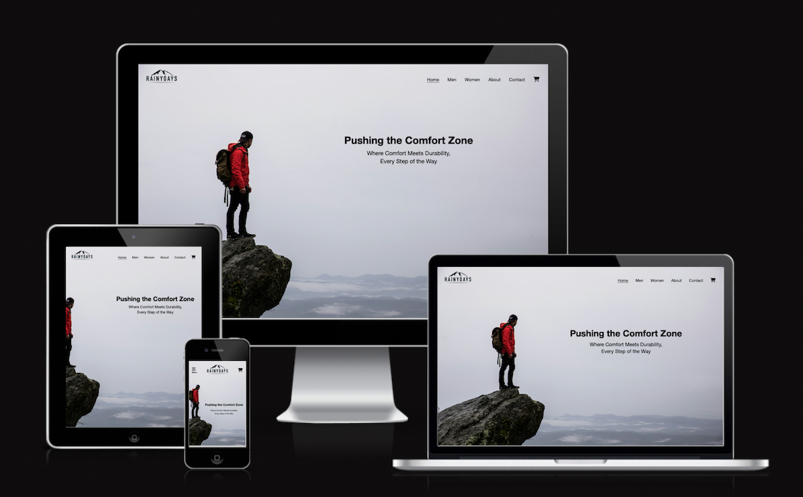

# Rainy Days



## Table of Contents

1. [Description](#description)
2. [Technologies Used](#technologies-used)
3. [How to Run](#how-to-run)
4. [Contact](#contact)
5. [Acknowledgments](#acknowledgments)

## Description

[View Project](https://mayamariaruth.github.io/html-css-course-assignment/index.html)

This project is an interactive e-commerce website designed to sell men's and women’s rain jackets suitable for a variety of outdoor activities. The primary goal is to provide a user-friendly online shopping experience where customers can browse, and purchase durable, weather-resistant jackets that are perfect for hiking, skiing, camping, canoeing, and other outdoor adventures.

The website is built using JavaScript to dynamically display products retrieved from an API, allowing users to view detailed product pages, add items to their cart, and proceed to checkout. The project features a responsive design with a seamless shopping experience, complete with loading indicators and error handling for a smooth user journey.

### Key features

- A homepage displaying a list of products.
- Product pages with detailed descriptions and the option to add items to a cart.
- A shopping cart page where users can view and modify their selections.
- A checkout page for finalizing purchases, followed by an order confirmation page.

## Technologies Used

- **HTML5**
- **CSS3**
- **JavaScript**
- **GitHub** (for version control and hosting)

## How to Run

To view this portfolio locally, you can clone the repository:

```bash
git clone https://github.com/Mayamariaruth/html-css-course-assignment.git
```

## Contact

You can connect with me through my [LinkedIn Profile](https://www.linkedin.com/in/maya-thompson-9b602a255/).

## Acknowledgments

- https://stackoverflow.com/
- https://www.w3schools.com/
- https://www.geeksforgeeks.org/
- https://www.youtube.com/
